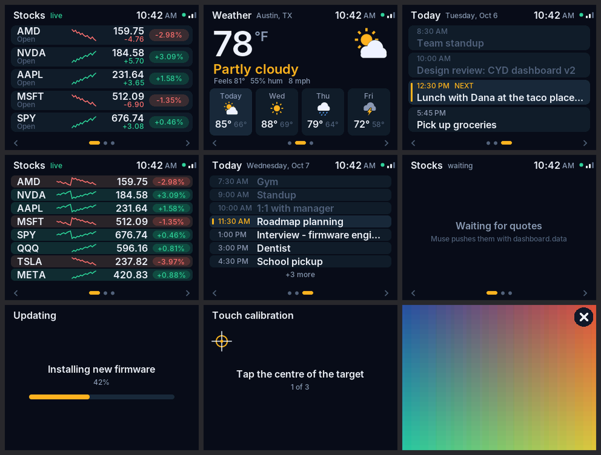

# CYD Dashboard (fork notes)

A fork of Meta's `muse-gadget-sdk` that turns the ESP32-2432S028R ("Cheap
Yellow Display") into a touch dashboard for Muse. Built to live sealed in a
case: firmware and SD-card assets update over the air, and a bad update rolls
itself back.




## What it is

- **Screens:** stocks (with sparklines and a flash when a price moves),
  weather (icons, 4-day forecast), and today's calendar (past events dimmed,
  the next one highlighted). Long lists switch to compact rows.
- **Header:** clock (SNTP + your time zone), Link status dot, Wi-Fi bars.
- **Touch:** swipe or tap the `<` `>` zones; screens slide. Hold a finger
  down for 5 s to calibrate touch.
- **Backlight:** follows the room's light sensor, dims at night, wakes on
  touch.
- **Takeover:** Muse can show a full-screen image (`dashboard.takeover`,
  `display.draw_url`, `display.draw_sd`); **X** closes it, and it returns to
  the dashboard by itself after 10 minutes.
- **Data:** stocks/weather from `bridge/` (pushed by Muse with
  `dashboard.data`, or polled from the NAS); the calendar pushed by Muse.
- **Over the air:** firmware (`device.ota`) and SD-card files (`sd.fetch`).

Version: `esp32/version.txt` (1.1.0).

## Preview without a board

```sh
cd esp32
tools/dash_preview/run.sh        # needs cc, python3 with Pillow + numpy
open build-preview/screens.png build-preview/demo.gif
```

This compiles the real dashboard sources against stub ESP-IDF headers, plays
a scripted session (data pushes, a swipe, taps, calibration, an update, an
image), and renders every screen plus the animations. Run it after any UI
change; `docs/dashboard/` holds the committed copies shown above.

## Hardware (ESP32-2432S028R)

| Part | Pins | Driven by |
|---|---|---|
| ILI9341 display | SCK 14, MOSI 13, CS 15, DC 2 | SPI2_HOST (`led_status.c`) |
| Backlight | 21 | LEDC PWM (`dash_backlight.c`) |
| Light sensor (LDR) | 34 | ADC1 channel 6 |
| XPT2046 touch | CLK 25, MOSI 32, MISO 39, CS 33, IRQ 36 | bit-banged (`dash_touch.c`) |
| SD card | SCK 18, MOSI 23, MISO 19, CS 5 | SPI3_HOST (`sd_card.c`) |

Touch and SD do **not** share the display's bus.

## Settings (Kconfig, "ESP32 Device SDK")

Put personal values in `esp32/devices/sdkconfig.local` (git-ignored, see
`sdkconfig.local.example`); `tools/board.sh` loads it last.

| Option | Default | |
|---|---|---|
| `CONFIG_GADGET_SDK_TOKEN` | — | **required** for OTA images |
| `HOMEHUB_DASHBOARD_TZ` | `CST6CDT,M3.2.0,M11.1.0` | POSIX time zone |
| `HOMEHUB_DASHBOARD_CLOCK_24H` | n | |
| `HOMEHUB_DASHBOARD_BL_AUTO` | y | follow the light sensor |
| `HOMEHUB_DASHBOARD_BL_LDR_BRIGHT` / `_DARK` | 50 / 600 | raw sensor readings; tune with `dashboard.debug` |
| `HOMEHUB_DASHBOARD_BL_NIGHT_START` / `_END` / `_PCT` | 23 / 7 / 5% | night dimming (same hour = off) |
| `HOMEHUB_DASHBOARD_BL_IDLE_MIN` / `_PCT` | 0 (off) / 30% | dim when untouched |
| `HOMEHUB_DASHBOARD_TAKEOVER_TIMEOUT_MIN` | 10 | 0 = images stay until X |
| `HOMEHUB_DASHBOARD_TOUCH_SWAP_XY` / `_INVERT_X` / `_INVERT_Y` | n | defaults until calibrated |
| `HOMEHUB_DASHBOARD_BRIDGE_POLL` / `_URL` | n | poll the NAS bridge directly |

## Updating over the air

No USB needed once 1.1.0 is on the board. **Flash 1.1.0 over USB once
before closing the case:** 1.0.5 only accepts `https://` OTA URLs (which may
not fit in its RAM) and has none of the safety checks below. If the case is
already closed, `device.ota` with an `https://` URL is worth a try; if it
fails, nothing is installed.

1. Bump `esp32/version.txt` (the board skips images that are not newer).
2. Build: `cd esp32 && tools/cyd_release.sh` → `release/cyd-dashboard-v<ver>.bin`.
   It refuses to build without the SDK token, and prints the size and the
   exact command.
3. Serve the `.bin` anywhere the board can reach, plain `http://` is fine,
   and run `device.ota {"url": "http://<host>/cyd-dashboard-v<ver>.bin"}`.

What happens on the board, and why it can't brick itself:

- The screen shows **Updating** with a progress bar.
- The image's RSA signature is checked before it is installed (the dev key in
  `esp32/dev_signing_key.pem`; the VM must build with the same key as the
  running firmware). That is why plain HTTP is safe, and HTTPS isn't needed
  (a second TLS session doesn't fit in this board's RAM).
- The new firmware boots on probation. It is accepted only once the Link
  session is back **and** the dashboard has drawn and run for 30 s. If it
  crashes first, or doesn't reconnect within 5 minutes, the bootloader goes
  back to the previous firmware.
- Even after acceptance, three crash resets in a row switch back to the other
  firmware slot (`ota_crash_guard_boot()`).

Asking Muse to do it end to end ("update the dashboard firmware") works if its
VM has ESP-IDF v6.0.1, this repo, `devices/sdkconfig.local` with the token,
and somewhere to serve the file over HTTP. The cyd board is also built in CI
(`.github/workflows/esp32.yml`) on pull requests.

## SD card over the air

`sd.fetch {"url", "path", "sha256"?}` downloads any file (up to 8 MB) to
`/sdcard/<path>`, writing to `<path>.part` and renaming only when complete,
and only if the SHA-256 matches when one is given. Then e.g.
`display.draw_sd {"path": "images/cat.jpg"}` shows it (baseline JPEG).
`sd.list`, `sd.read`, `sd.write`, `sd.remove` and `sd.info` cover the rest.

## Commands (advertised to Muse)

- `dashboard.data` `{screen: "bridge" | "calendar", json}`: push data. `json`
  may be a string or an object (also accepted as `data`). An empty `stocks`
  list or a missing `weather` keeps the last good data.
  Calendar: `{"label": "Tuesday, Oct 6", "events": [{"time": "5:45 PM", "title": "..."}]}`.
- `dashboard.takeover` `{url}`, `display.draw_url`, `display.draw_sd {path}`:
  full-screen image with X. `display.show_animation` closes it.
- `dashboard.calibrate` `{reset?}`: touch calibration screen (or forget it).
- `dashboard.debug`: touch raw/pressure, light sensor, backlight, state, free
  heap.
- `device.ota` `{url, force?}`, `sd.fetch`: see above.

## Bridge

See `bridge/README.md`. Muse's VM runs `bridge/fetch.py` (needs `bridge.py`
next to it) and pushes the output with `dashboard.data screen="bridge"`; or
run `bridge.py` on the NAS (`docker compose up -d --build`) and enable
`HOMEHUB_DASHBOARD_BRIDGE_POLL`. Set `LOCATION`, `LAT`, `LON`, `TZ` and
`WATCHLIST` there.

## Build and first flash (USB, once)

```sh
cd esp32
export IDF_PATH=~/esp/esp-idf-v6 && . $IDF_PATH/export.sh
tools/board.sh cyd build
tools/board.sh cyd flash /dev/cu.usbserial-1230
```

## How it renders

- Only the dashboard task draws; other tasks change state and wake it.
- It sleeps between events (touch interrupt, data, a 5 s header tick), polls
  at 10 ms only while a finger is down, and at ~12 fps only while something
  animates.
- Frames are built once from a store snapshot and painted in 4-row strips,
  double-buffered over SPI DMA. Only rows that changed are repainted.
- Text is Inter (SIL OFL, `main/dashboard/assets/`), anti-aliased, stored
  as 4-bit alpha with the icons (~54 KB of flash). Regenerate with
  `assets/gen_assets.py`.
- Colours are RGB565 stored high byte first, the panel's byte order
  (`DASH_RGB` in `dash_draw.h`).

## Debugging

UART0 at 115200 through the CH340 (`screen /dev/cu.usbserial-1230 115200`),
or remotely with `dashboard.debug`. Useful log lines:
`dash: activating dashboard`, `dash: first frame drawn`,
`link: OTA image validated`, `link.ota: crash loop ...`, `dash.bl: ...`.

## Layout

```
esp32/main/dashboard/    dashboard: task, screens, drawing, touch, store,
                         clock, backlight, icons, generated assets
esp32/main/sd_*.c        SD card mount, JPEG viewer, sd.fetch downloads
esp32/main/ota.c         OTA (+ progress, crash-loop guard)
esp32/tools/dash_preview host preview (stub IDF headers)
esp32/tools/cyd_release.sh  build an OTA image
bridge/                  Nasdaq + Open-Meteo → JSON
```

## Upstream

Forked from `facebookincubator/muse-gadget-sdk` at `b139b45`. Dashboard code
is isolated in `main/dashboard/`; SDK changes are the display hooks in
`led_status.c`, the command handlers in `app.c`/`noise_control.cpp`, the
OTA additions in `ota.c`, and the Kconfig options.
